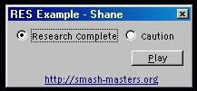



## Sound RES Example

### Description

Well i couldnt find any working or detailed examples on how to do this. So after about 30 minutes of messing around i figured it out and made a DETAILED example on how to use a sound.res file in your programs. This is very good to use, cause it causes your program no lag, unlike OLE. Also it keeps those lamos from stealing your stored sounds ! Vote if you like this example !
 
### More Info
 

             |
---                |---
**Submitted On**   |2005-08-01 11:32:00
**By**             |[Shane Briley](https://github.com/Planet-Source-Code/PSCIndex/blob/master/ByAuthor/shane-briley.md)
**Level**          |Intermediate
**User Rating**    |4.3 (13 globes from 3 users)
**Compatibility**  |VB 5\.0, VB 6\.0
**Category**       |[Sound/MP3](https://github.com/Planet-Source-Code/PSCIndex/blob/master/ByCategory/sound-mp3__1-45.md)
**World**          |[Visual Basic](https://github.com/Planet-Source-Code/PSCIndex/blob/master/ByWorld/visual-basic.md)
**Archive File**   |[Sound\_RES\_191976812005\.zip](https://github.com/Planet-Source-Code/shane-briley-sound-res-example__1-62018/archive/master.zip)

